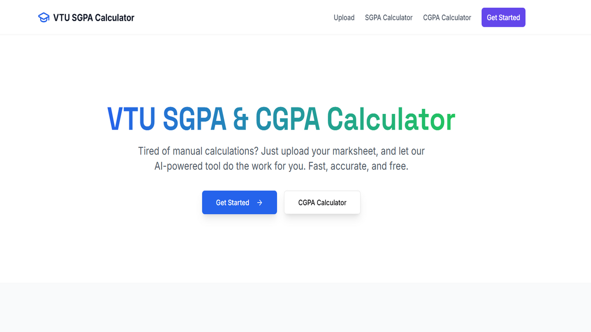
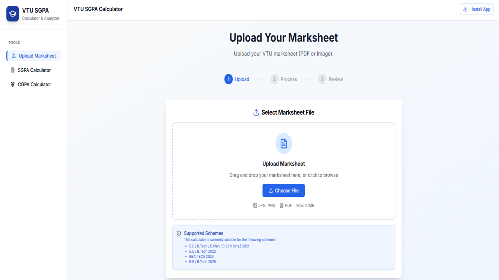

## VTU SGPA & CGPA Calculator

Fast, accurate VTU SGPA and CGPA calculator with AI-powered marksheet extraction, manual entry, and clean PDF exports. Built with Next.js, TypeScript, Tailwind, and ShadCN UI.




### Highlights
- Upload your VTU marksheet (PDF/Image) to auto-extract subjects, internals/externals, and credits using Gemini via Genkit.
- Manual entry flow when you don’t have a file or want full control.
- Accurate SGPA calculation + dedicated CGPA calculator.
- One-click PDF export of results.
- PWA: install to your phone for an app-like experience, offline-ready basics.

---

## Mobile app download

- Android (APK direct download): [VTU Calculator app](https://github.com/bgmanu2426/VTU-SGPA_Calculator/releases/download/1.0.0/SGPA.Calculator.apk)
- iOS: Install the PWA from Safari (open the site, tap Share → Add to Home Screen).

Tip: This app is a PWA. Users on Android and iOS can install it directly from the browser as “Add to Home Screen” or "Install App" if a store link isn’t available yet.

---

## Live site

The live site is hosted on Vercel.

- Live URL: [Live Preview](https://vtusgpacalculator.vercel.app)

---

## How it works
1. Upload a VTU marksheet (PNG/JPG/PDF) or choose manual entry.
2. The AI flow extracts subject data and marks using Genkit + Gemini.
3. Credits are fetched per scheme and combined with marks to compute SGPA.
4. Export or share a polished PDF. Use the CGPA tool to aggregate semester SGPAs.

---

## Tech stack
- Next.js (App Router) + TypeScript
- Tailwind CSS + ShadCN UI (Radix primitives)
- Genkit + Google Gemini for data extraction
- PWA enhancements (installable on mobile)

---

## Getting started (local)

1) Clone and install
```bash
git clone https://github.com/bgmanu2426/VTU-SGPA_Calculator.git
cd VTU-SGPA_Calculator
npm install
```

2) Env vars
Create a `.env` in the project root:
```
GEMINI_API_KEY=your_google_ai_api_key
```

3) Run dev server
```bash
npm run dev
```
App runs at http://localhost:9002

---

## Project structure
- `src/app` – App Router pages (home, calculator, CGPA, upload)
- `src/components` – UI components and calculators
- `src/ai` – Genkit flows (marksheet extraction, credits fetching)
- `public/` – PWA manifest, icons, screenshots

---

## Contributing
Issues and PRs are welcome. Please open an issue to discuss significant changes.

---

## License
MIT – see [LICENSE.md](LICENSE.md).
